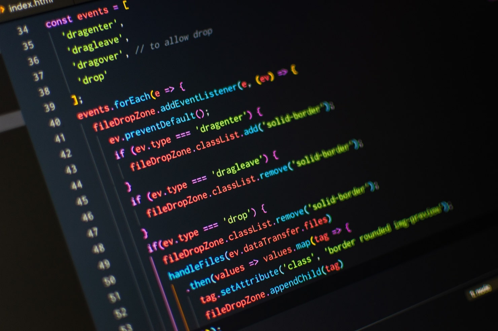

Do you want to become a web developer? If so, you would likely require a plan on how to grasp it most effectively.

### YouTube courses

Back in 2018, when I was only just starting learning to code, the most critical thing to me was to perceive anything. At this terrible time, that was possible only by actively watching YouTube videos. Why? I didn't understand any documentation and loved seeing someone creating projects. By performing this, I learned a lot plus it encouraged me to learn the basics. To this day, I still love learning by watching videos and don't find anything wrong about it, but this is the topic for another post.

### Books

I don't have any experience reading books about software development, but still, I can suggest you get an up to date, recommended book if you prefer reading and learning on your own than someone teaching you how to code, as it is with the YouTube courses. It's an effective way of learning, but in programming, you want to see the results of your beautiful political work immediately, and by reading a book with code examples you. It can, also, be a bad way of learning because technologies and languages get updated nearly every day and you can miss some valuable information that wasn't included in a book.

### Paid courses

It's conceivably a practical way of learning, but I've never paid to acquire something as you can find anything free on the internet instead. Paid courses sometimes contain pieces of information that are not mentioned by anyone in a YouTube video and sometimes are more valuable than a free video but like 99% of the information included in that \$99 paid course is out there on the internet for free. The sole difference between free and paid courses that I frequently observe is the deeper explanation of a topic, said more clearly than it is on the documentation. This method of learning demonstrates only one advantage in my opinion, which is the motive to get things done after you invest your money on that. Other than that, I don't recommend paid courses as your way of learning.

### Your projects

As a beginner programmer, you want to understand pretty much everything about your language, technologies, etc. You don't want to not know what you can do.

### Quick summary

Learn to code by watching YouTube videos related to coding and courses.
